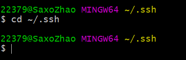
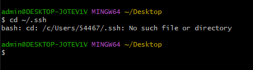
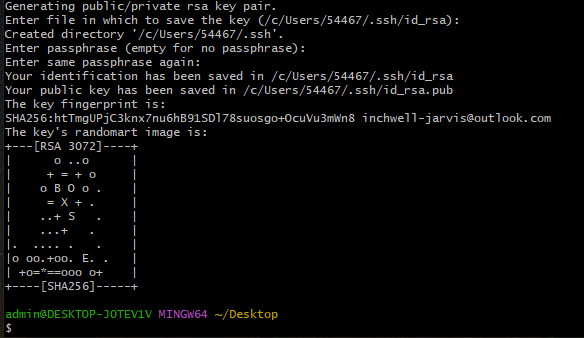
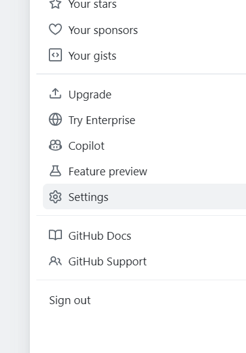
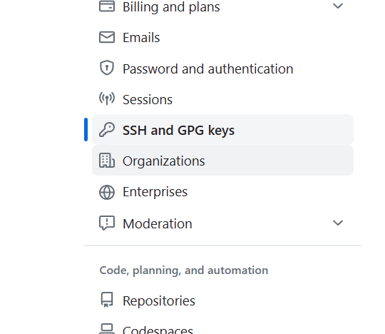
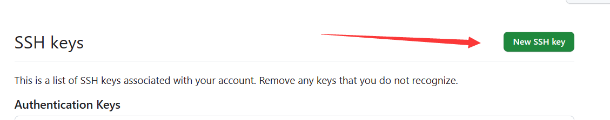
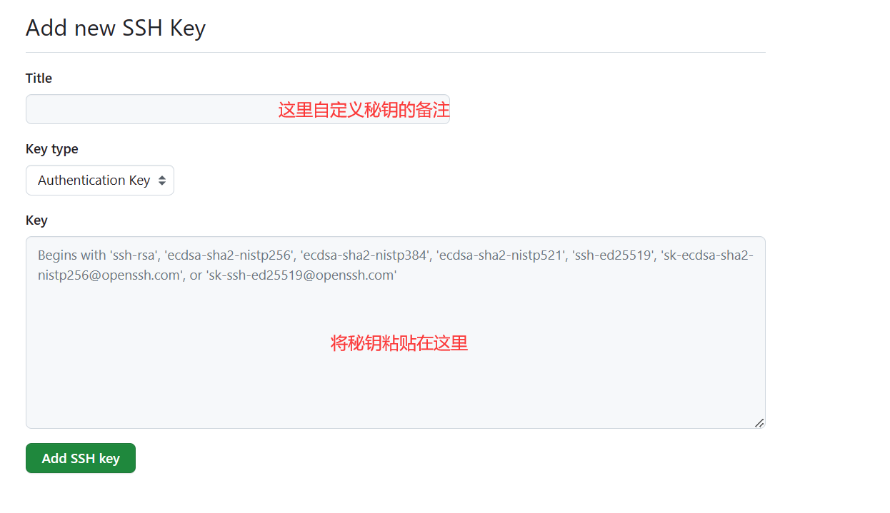
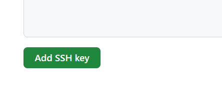

# SSH秘钥连接GitHub

首先，检查下自己之前有没有已经生成：

打开 Git Bash

输入 ``` cd ~/.ssh ``` 以查看是否存在现有的 SSH 密钥

如果能进入到.ssh文件目录下 ，则证明，之前生成过.ssh秘钥，可以直接使用里面的秘钥  

  

如果不能进入到.ssh文件目录下，则：  



检测下自己之前有没有配置：

```git config user.name``` 和 ```git config user.email```（直接分别输入这两个命令）

2.1 如果之前没有创建，则执行以下命令配置信息：

``` javascript
git config --global user.name 'xxxxx'

git config --global user.email 'xxx@xxx.xxx'
```

2.2生成秘钥
``` javascript
ssh-keygen -t rsa -C '上面的邮箱'
```

接着按3个回车 则：得到 SHA256 结果即生成成功




最后在.ssh目录下得到了两个文件：id_rsa（私有秘钥）和id_rsa.pub（公有密钥）

第三步、如果想登陆远端，则需要将id_rsa.pub里的秘钥添加到远端。

首先，去.ssh目录下找到id_rsa.pub这个文件夹打开复制全部内容。

接着：

1.登录GitHub，进入你的Settings  


2.会看到左边这些目录，点击SSH and GPG keys    



3.创建New SSH key   



4.粘贴你的密钥到你key输入框中  



5.点击Add SSH key 



6.再弹出窗口，输入你的GitHub密码，点击确认按钮。

7.到此，就大功告成了。

第四步 测试。

在命令窗口上输入 ssh -T git@github.com 按回车键，如看到以下信息，那么就完美了。

```
Hi 007xiaoyang! You've successfully authenticated, but GitHub does not provide s hell access.
```

